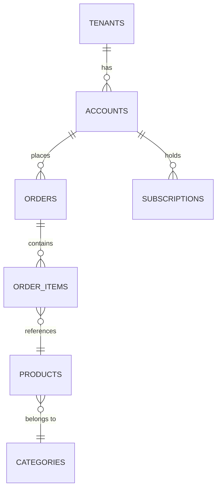

# Schema Conventions — spex-db

Naming rules, type rules, audit fields, tenancy isolation, idempotency keys, ERD notation,
and index design patterns.

---

## Naming Conventions

| Object | Convention | Example |
|--------|-----------|---------|
| Table | `snake_case`, plural | `customer_orders` |
| Column | `snake_case` | `created_at`, `tenant_id` |
| Primary key | `id` (always) | `id BIGINT GENERATED ALWAYS AS IDENTITY PRIMARY KEY` |
| Foreign key | `<referenced_table_singular>_id` | `customer_id`, `tenant_id` |
| Index | `idx_<table>_<columns>` | `idx_orders_customer_id` |
| Unique constraint | `uq_<table>_<columns>` | `uq_accounts_email` |
| Check constraint | `chk_<table>_<description>` | `chk_orders_positive_amount` |
| Junction table | `<table_a>_<table_b>` (alphabetical) | `role_users` |
| Partial index | `idx_<table>_<col>_<qualifier>` | `idx_orders_status_active` |
| Covering index | `idx_<table>_<cols>_covering` | `idx_orders_tenant_status_covering` |

---

## Type Rules

| Use case | Forbidden | Correct |
|----------|-----------|---------|
| Monetary amounts | `FLOAT`, `DOUBLE`, `REAL` | `DECIMAL(19,4)` or `BIGINT` (integer cents) |
| Timestamps | `DATE` for datetime precision | `TIMESTAMPTZ` (PostgreSQL) / `DATETIME(6) UTC` (MySQL) |
| Boolean flags | `INT`, `CHAR(1)`, `TINYINT` | `BOOLEAN` |
| Large text | `VARCHAR(MAX)` without thought | `TEXT` (unbounded) or `VARCHAR(N)` with explicit limit |
| UUIDs | `CHAR(36)` | `UUID` native type (PostgreSQL) or `BINARY(16)` (MySQL 8+) |
| Enum-like fields | Unconstrained `TEXT` | `TEXT` + `CHECK` constraint or a lookup/reference table |
| PKs on large tables | `INT` / `SERIAL` | `BIGINT GENERATED ALWAYS AS IDENTITY` / `BIGSERIAL` |
| Structured metadata | `TEXT` (serialized JSON) | `JSONB` (PostgreSQL) — queryable, indexable |
| Arrays | Multiple columns or junction table | `TEXT[]` / `BIGINT[]` (PostgreSQL) when the array is truly atomic |

---

## Audit Fields

Every table must include:

```sql
created_at  TIMESTAMPTZ NOT NULL DEFAULT NOW(),
updated_at  TIMESTAMPTZ NOT NULL DEFAULT NOW()
```

For soft-delete (when hard deletes are disallowed):

```sql
deleted_at  TIMESTAMPTZ NULL   -- NULL means active; non-NULL means soft-deleted
```

### Auto-update `updated_at` with a trigger (PostgreSQL)

```sql
-- Reusable trigger function (create once per database)
CREATE OR REPLACE FUNCTION set_updated_at()
RETURNS TRIGGER LANGUAGE plpgsql AS $$
BEGIN
  NEW.updated_at = NOW();
  RETURN NEW;
END;
$$;

-- Apply to each table
CREATE TRIGGER trg_orders_updated_at
  BEFORE UPDATE ON orders
  FOR EACH ROW EXECUTE FUNCTION set_updated_at();
```

---

## Tenancy Isolation

All multi-tenant tables must carry a `tenant_id` foreign key:

```sql
tenant_id  BIGINT NOT NULL REFERENCES tenants(id),
-- Plus index (in the same migration):
CREATE INDEX idx_<table>_tenant_id ON <table>(tenant_id);
```

### Isolation strategy options

| Strategy | How | When to choose |
|----------|-----|----------------|
| **Row-Level Security (RLS)** | `CREATE POLICY` scoped to `current_setting('app.tenant_id')` | PostgreSQL, maximum enforcement |
| **Application-layer guard** | `WHERE tenant_id = :current_tenant` in every query via base repository | Any DB engine, simpler ops |
| **Schema-per-tenant** | Separate PostgreSQL schema per tenant | Very high isolation requirement, low tenant count |

**Default:** RLS for PostgreSQL; application-layer guard for MySQL.

### RLS example (PostgreSQL)

```sql
ALTER TABLE orders ENABLE ROW LEVEL SECURITY;

CREATE POLICY orders_tenant_isolation ON orders
  USING (tenant_id = current_setting('app.tenant_id')::BIGINT);

-- Application sets the tenant before each query:
-- SET LOCAL app.tenant_id = '42';
```

---

## Idempotency Key Fields

Write-once operations (payments, order submissions, webhook deliveries) must carry a unique idempotency key:

```sql
-- Single-tenant
idempotency_key  TEXT NOT NULL,
CONSTRAINT uq_<table>_idempotency_key UNIQUE (idempotency_key)

-- Multi-tenant (key scoped per tenant)
CONSTRAINT uq_<table>_tenant_idempotency UNIQUE (tenant_id, idempotency_key)
```

- The key is supplied by the **caller** — never generated server-side at insert time
- After a definitive response (success or non-retryable error), the caller must not reuse the key

---

## Index Design Patterns

### Single-column B-tree (default)
```sql
-- FK index — always required
CREATE INDEX idx_orders_customer_id ON orders(customer_id);
```

### Composite index — column order matters
```sql
-- Query: WHERE tenant_id = ? AND status = ? ORDER BY created_at DESC
-- Most selective column first; ORDER BY column last
CREATE INDEX idx_orders_tenant_status_created
  ON orders(tenant_id, status, created_at DESC);
```

**Rule:** A composite index on `(A, B, C)` satisfies queries filtering on `A`, `A+B`, or `A+B+C`.
It does **not** help queries filtering on `B` alone or `C` alone.

### Partial index — filter on a common predicate
```sql
-- Only active (non-deleted) orders are queried 99% of the time
CREATE INDEX idx_orders_tenant_status_active
  ON orders(tenant_id, status)
  WHERE deleted_at IS NULL;

-- Only unprocessed events need fast lookup
CREATE INDEX idx_events_pending
  ON events(created_at)
  WHERE processed_at IS NULL;
```

Partial indexes are smaller and faster than full indexes — use them when a stable predicate covers the hot query path.

### Covering index — index-only scan (PostgreSQL `INCLUDE`)
```sql
-- Query: SELECT id, status, total_cents FROM orders WHERE tenant_id = ? AND status = 'pending'
-- INCLUDE the selected columns so the query never touches the heap
CREATE INDEX idx_orders_tenant_status_covering
  ON orders(tenant_id, status)
  INCLUDE (id, total_cents);
```

### GIN index — JSONB and full-text search
```sql
-- JSONB containment queries: metadata @> '{"source":"api"}'
CREATE INDEX idx_orders_metadata_gin ON orders USING GIN (metadata);

-- Full-text search on a tsvector column
CREATE INDEX idx_products_fts ON products USING GIN (search_vector);
```

### Expression index
```sql
-- Case-insensitive email lookup
CREATE UNIQUE INDEX uq_users_email_lower ON users (lower(email));
```

### Index usage anti-patterns

| Anti-pattern | Problem | Fix |
|--------------|---------|-----|
| Index on low-cardinality column alone (e.g. `boolean`) | Planner may prefer seq scan | Partial index or composite with higher-cardinality prefix |
| Index on every column "just in case" | Write amplification, storage cost | Index only columns that appear in WHERE / ORDER BY / JOIN |
| Composite index with wrong column order | Index unusable for most queries | Put most selective / equality columns first |
| Missing index on large FK in a child table | Sequential scan on DELETE/UPDATE of parent | Always index FK columns |

---

## ERD Notation Guide

### Mermaid ERD (preferred for artifacts)

````markdown

````

Mermaid cardinality:

| Symbol | Meaning |
|--------|---------|
| `\|\|` | Exactly one |
| `o\|` | Zero or one |
| `}o` | Zero or many |
| `}\|` | One or many |

### ASCII (compact, inline)
```
tenants ──< accounts ──< orders >── order_items >── products
              │                                          │
              └── subscriptions                         └── categories
```

Cardinality: `──<` one-to-many, `>──<` many-to-many, `──` one-to-one.

---

## Quick Reference Card

```
✓ snake_case tables (plural) and columns
✓ BIGINT GENERATED ALWAYS AS IDENTITY for PKs on large tables
✓ <ref>_id for FKs + explicit B-tree index in same migration
✓ DECIMAL(19,4) or BIGINT cents for money — never FLOAT
✓ TIMESTAMPTZ for all timestamps
✓ created_at + updated_at on every table
✓ deleted_at NULL for soft-delete tables
✓ tenant_id FK + RLS (or app-layer guard) on multi-tenant tables
✓ idempotency_key UNIQUE for write-once operations
✓ CHECK constraints for enum-like TEXT columns
✓ Composite index: most selective column first
✓ Partial index for hot-path filtered queries
✓ Covering index (INCLUDE) to enable index-only scans
✓ GIN index for JSONB and tsvector columns
✓ CREATE INDEX CONCURRENTLY on existing large tables
✗ No FLOAT/DOUBLE for money
✗ No circular FKs
✗ No unindexed FK columns
✗ No INT PKs on large tables
✗ No unconstrained TEXT for enum-like fields
✗ No composite index with wrong column order
```
